# Report

## GPU and Environment

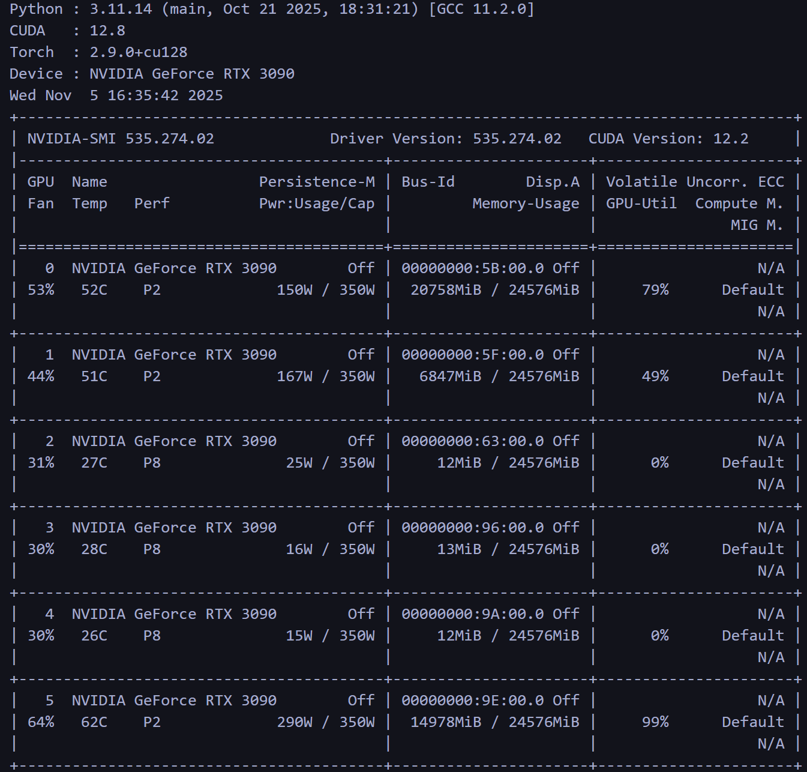
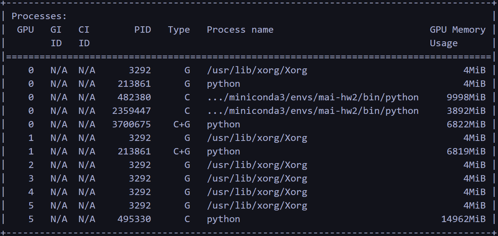

## Task 1: Zero-Shot

flowers_template_base = "A photo of a {label}."
flowers_template_custom_1 = "A photo of a {label}, a type of flower."
flowers_template_custom_2 = "A botanical photo of a {label}."

cub_template_base = "A photo of a {label}."
cub_template_custom_1 = "A photo of a {label}, a type of bird."
cub_template_custom_2 = "A bird species called {label}."

### Prompt Accuracy
| Dataset | Oxford 102 | CUB-200 |
|---------|-------------|---------|
| Base   | 74.91%     | 62.36%   |
| Custom 1| 77.62% | 62.10% |
| Custom 2| 78.08% | 60.82% |

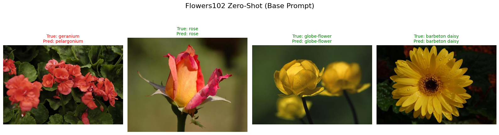
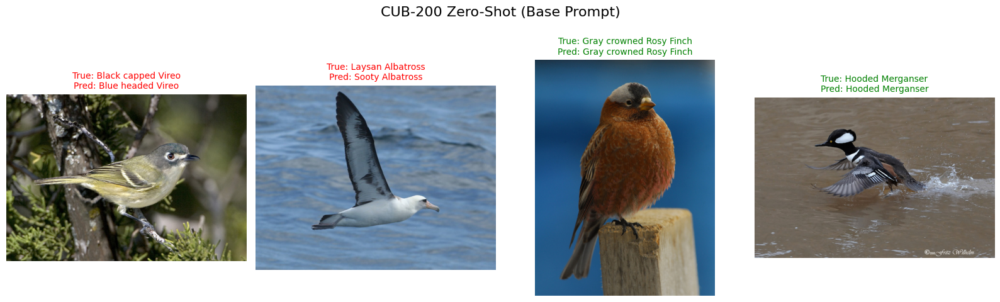

### Test on Pictures I Took

Top-5 predictions:
hibiscus                                  0.844
tree mallow                               0.061
trumpet creeper                           0.023
mallow                                    0.019
cape flower                               0.012
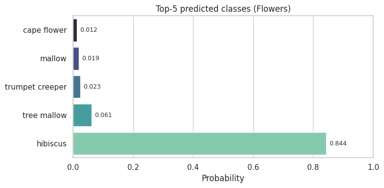

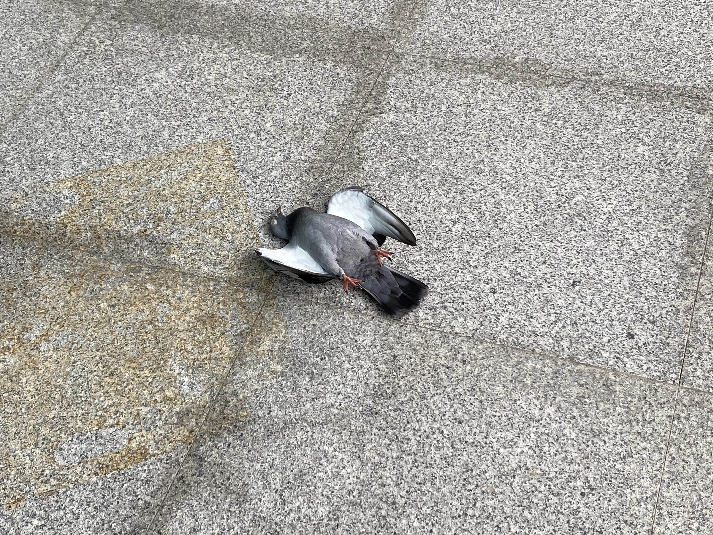
Top-5 predictions:
Chuck will Widow                          0.308
Sayornis                                  0.136
Worm eating Warbler                       0.071
Clay colored Sparrow                      0.066
Seaside Sparrow                           0.044

## Task 2: Linear Probe

### Linear Head

[Flowers102] Test: loss 0.1250 | acc 98.73%
[Flowers102] Epoch 1/10 | train loss 3.3739 acc 52.94% | val loss 1.9342 acc 86.27%
[Flowers102] Epoch 2/10 | train loss 1.1633 acc 95.81% | val loss 0.7152 acc 97.55%
[Flowers102] Epoch 3/10 | train loss 0.4669 acc 99.35% | val loss 0.3969 acc 98.53%
[Flowers102] Epoch 4/10 | train loss 0.2635 acc 99.78% | val loss 0.2642 acc 98.04%
[Flowers102] Epoch 5/10 | train loss 0.1742 acc 99.78% | val loss 0.2030 acc 99.02%
[Flowers102] Epoch 6/10 | train loss 0.1277 acc 99.84% | val loss 0.1682 acc 98.53%
[Flowers102] Epoch 7/10 | train loss 0.0991 acc 99.84% | val loss 0.1455 acc 99.02%
[Flowers102] Epoch 8/10 | train loss 0.0792 acc 99.95% | val loss 0.1276 acc 99.02%
[Flowers102] Epoch 9/10 | train loss 0.0654 acc 99.89% | val loss 0.1167 acc 99.51%
[Flowers102] Epoch 10/10 | train loss 0.0544 acc 99.95% | val loss 0.1093 acc 99.51%

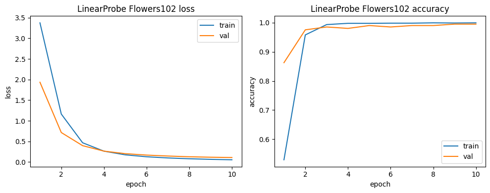

[CUB-200] Test: loss 0.5621 | acc 84.83%
[CUB-200] Epoch 1/10 | train loss 3.2733 acc 43.62% | val loss 1.7782 acc 66.00%
[CUB-200] Epoch 2/10 | train loss 1.1733 acc 80.57% | val loss 1.0686 acc 77.50%
[CUB-200] Epoch 3/10 | train loss 0.7010 acc 88.52% | val loss 0.8611 acc 80.00%
[CUB-200] Epoch 4/10 | train loss 0.5133 acc 91.12% | val loss 0.7399 acc 83.67%
[CUB-200] Epoch 5/10 | train loss 0.4033 acc 93.33% | val loss 0.6945 acc 82.67%
[CUB-200] Epoch 6/10 | train loss 0.3271 acc 94.66% | val loss 0.7088 acc 80.00%
[CUB-200] Epoch 7/10 | train loss 0.2769 acc 95.90% | val loss 0.6505 acc 83.83%
[CUB-200] Epoch 8/10 | train loss 0.2379 acc 96.37% | val loss 0.6229 acc 83.50%
[CUB-200] Epoch 9/10 | train loss 0.2050 acc 97.11% | val loss 0.6271 acc 82.17%
[CUB-200] Epoch 10/10 | train loss 0.1815 acc 97.72% | val loss 0.6159 acc 83.00%

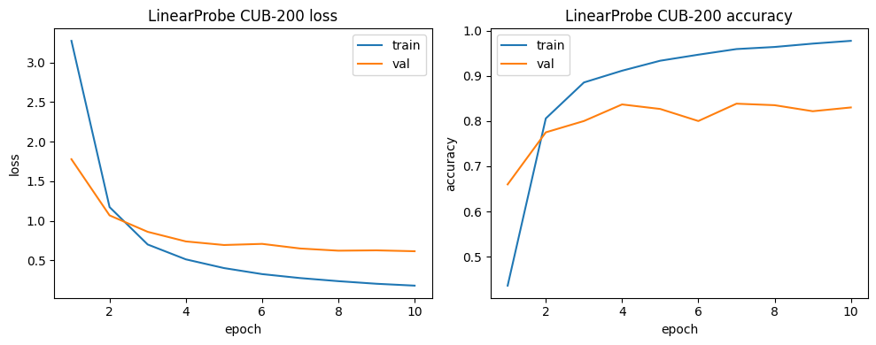

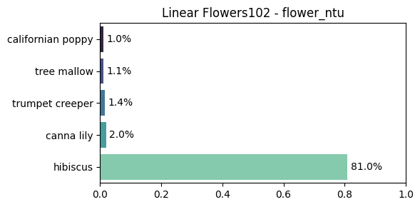
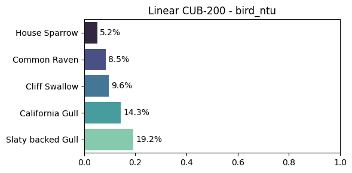

### LoRA Fine-Tuning

[LoRA Flowers102] Test: loss 0.0504 | acc 99.25%
[LoRA Flowers102] Epoch 1/10 | train loss 2.8988 acc 58.17% | val loss 0.8666 acc 95.10%
[LoRA Flowers102] Epoch 2/10 | train loss 0.3415 acc 99.24% | val loss 0.1840 acc 98.53%
[LoRA Flowers102] Epoch 3/10 | train loss 0.0891 acc 99.84% | val loss 0.1091 acc 99.51%
[LoRA Flowers102] Epoch 4/10 | train loss 0.0435 acc 99.89% | val loss 0.0799 acc 99.02%
[LoRA Flowers102] Epoch 5/10 | train loss 0.0262 acc 100.00% | val loss 0.0672 acc 99.51%
[LoRA Flowers102] Epoch 6/10 | train loss 0.0175 acc 100.00% | val loss 0.0561 acc 99.51%
[LoRA Flowers102] Epoch 7/10 | train loss 0.0129 acc 100.00% | val loss 0.0501 acc 99.51%
[LoRA Flowers102] Epoch 8/10 | train loss 0.0100 acc 100.00% | val loss 0.0446 acc 100.00%
[LoRA Flowers102] Epoch 9/10 | train loss 0.0081 acc 100.00% | val loss 0.0415 acc 100.00%
[LoRA Flowers102] Epoch 10/10 | train loss 0.0067 acc 100.00% | val loss 0.0385 acc 100.00%

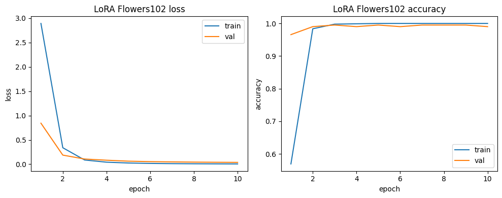

[LoRA CUB-200] Test: loss 0.4604 | acc 88.28%
[LoRA CUB-200] Epoch 1/10 | train loss 2.2521 acc 58.18% | val loss 0.8605 acc 80.67%
[LoRA CUB-200] Epoch 2/10 | train loss 0.5245 acc 88.34% | val loss 0.6125 acc 83.33%
[LoRA CUB-200] Epoch 3/10 | train loss 0.2876 acc 93.90% | val loss 0.5393 acc 84.67%
[LoRA CUB-200] Epoch 4/10 | train loss 0.1606 acc 97.03% | val loss 0.5314 acc 85.00%
[LoRA CUB-200] Epoch 5/10 | train loss 0.0867 acc 98.87% | val loss 0.5239 acc 86.50%
[LoRA CUB-200] Epoch 6/10 | train loss 0.0451 acc 99.72% | val loss 0.5204 acc 85.83%
[LoRA CUB-200] Epoch 7/10 | train loss 0.0258 acc 99.94% | val loss 0.5047 acc 86.67%
[LoRA CUB-200] Epoch 8/10 | train loss 0.0170 acc 100.00% | val loss 0.5051 acc 87.17%
[LoRA CUB-200] Epoch 9/10 | train loss 0.0124 acc 100.00% | val loss 0.5080 acc 86.50%
[LoRA CUB-200] Epoch 10/10 | train loss 0.0098 acc 100.00% | val loss 0.5147 acc 86.83%

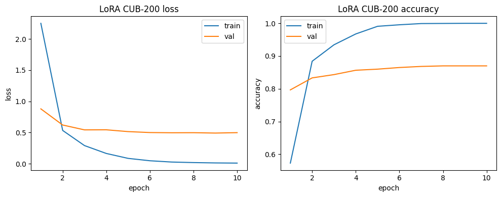

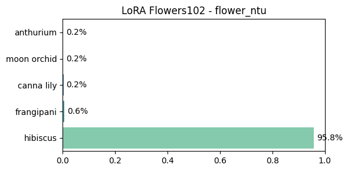
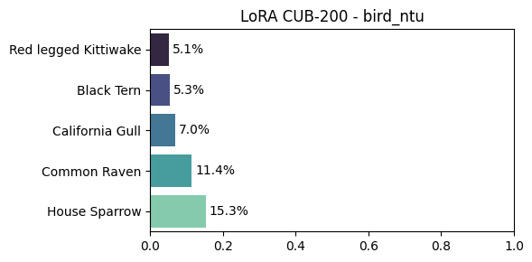